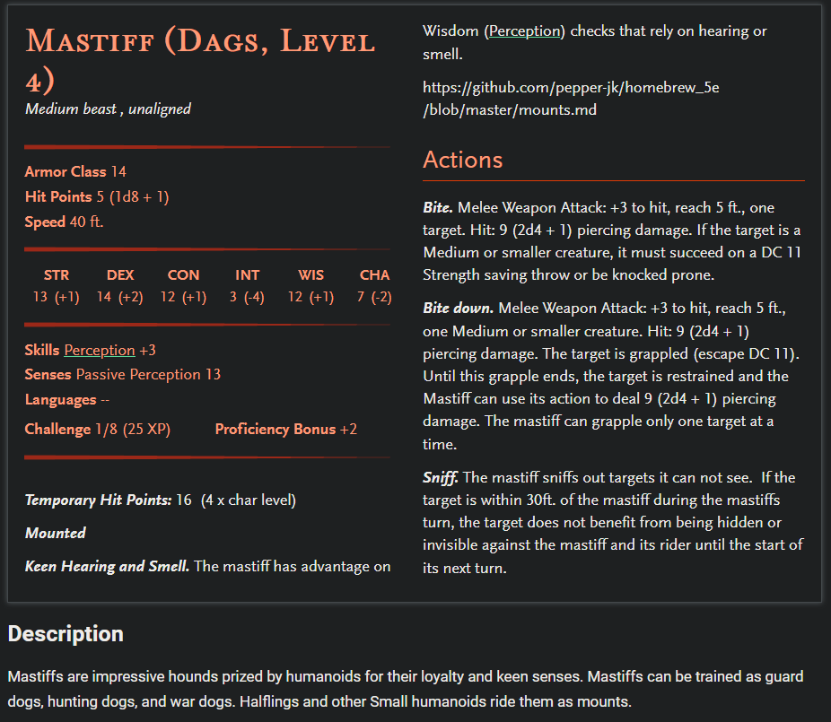

# **STORM KING'S THUNDER**

----
# Nitakula Wisdomtoother
**Feature: Wanderer**  
  You have an excellent memory for maps and geography, and you can always recall the general layout of terrain, settlements and other features around you. In addition, you can find food and fresh water for yourself and up to five other people each day, provided that the land offers berries, small game, water and so forth.

**Personality Traits**  
  I am obsessed with keeping my face crystals shiny. An individual worthy of my attention must have beautiful face crystals. There are two kinds of people that I absolutely despise: people with bad breath, and people that talks about books. I also sometimes have trouble recognizing sarcasm, and take what people say for its face value; often led to unnecessary fights according to my past travel companions. Haste to draw blade, never miss a smash. BASH HEAD TAKE CRYSTALS.

**Ideals**  
  A foe with a face pearls still attached to their jaw is an enemy yet to be defeated. I believe in my own judgement, though decisions must not be made with rush. Once decided, it must be carried out no matter the cost.

**Bonds**  
  All I wish is to spread the wonderful good words about dental hygiene to the world

**Flaws**  
  Anybody calling me weak or looks down at me based on my physical appearance. Very very afraid of heights. Sometimes dumb as a rock.

# World Map

----

# PLACES  

## Nightstone
- **Morak Urgray**   

  - Pesudo-leader of Nightstone. Runs the local inn
  - Gave us a letter of recommendation to show the lords of Waterdeep

## Goblin Cave near Nightstone
- **Grindlegar**  
  - Stone Giant  
  - Sethrose Cloud Giant  
  - Knew that we are coming  
  - Ordning = Divine power holding Giants in their social hierarchy.  
  - Something has broken the Ordning.   

## Shimmerhall
- **Breldin Brawnanvil**  
  Drwaf leader of Shimmerhall
- **Rella Brawnanvil**  
  Daughter of Breldin, tried up cause an uprising to overthrow her father

## Waterdeep

- **Quintin Nandor**  
  - Met in Trades Ward (Company HQ in Trades Ward)  
  - Son of Waterdeep's lord and future leader of Waterdeep

- **Helias Nandor**  
  - Quintin's brother at Waterdeep

- **Lucent enterprises**  
  - Company of the new lord of nightstone

- **Maxyer Graham**  
  - Solicited lawyer
  - 2 gp per day

- **Fish Kebob guy**  
  - Rumor: shortage of grains. Road between Waterdeep and Tribor

- **Erva**  
  - Tiefling at Boar's Gate Tavern

- **Merk**  
  - Well off looking older drwaven met at Boar's Gate Tavern  
  - One of the lord of Waterdeep, lives in Castle Ward, Pike avenue.  

### Point of Interest
- Taverns  
  - Boar's Gate Tavern (Trades Ward)  
  - Waking Gnome (Castle Ward)

### Notes 
- Mask Lords runs Waterdeep

----

# Allies
- **Felgolos**
  - Dragon disguised as a halfling
  - Exploring the world
  - Dislikes Zhentarim org
- **Lil'Sebastian**
  - [DnDBeyond Link](https://www.dndbeyond.com/monsters/1447662-mastiff-dags-level-4)
  - 

---- 

# Enemies

## Zhentarim 
- Underground organization up to no good

  - **Xolkin**  
    
    - Leader of the the spy group
    - Felgolos kidnapped him

  - **Kella**
    
    - Escaped from us at the Goblin cave  

----

# Quests

- Road blockage between Waterdeep Tribor  
  - Find and return Farren Nandor (500gp) 
  - Clear the blockade (500gp)

- From Merk (Waterdeep)  
  - 250gp to retrieve an unicorn statue (stolen, seems sincere about being stolen)    
  - It's at blue alley in sea ward 