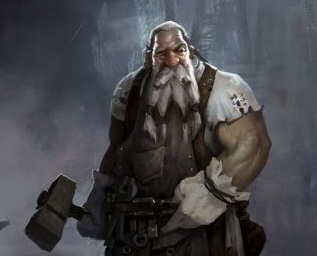
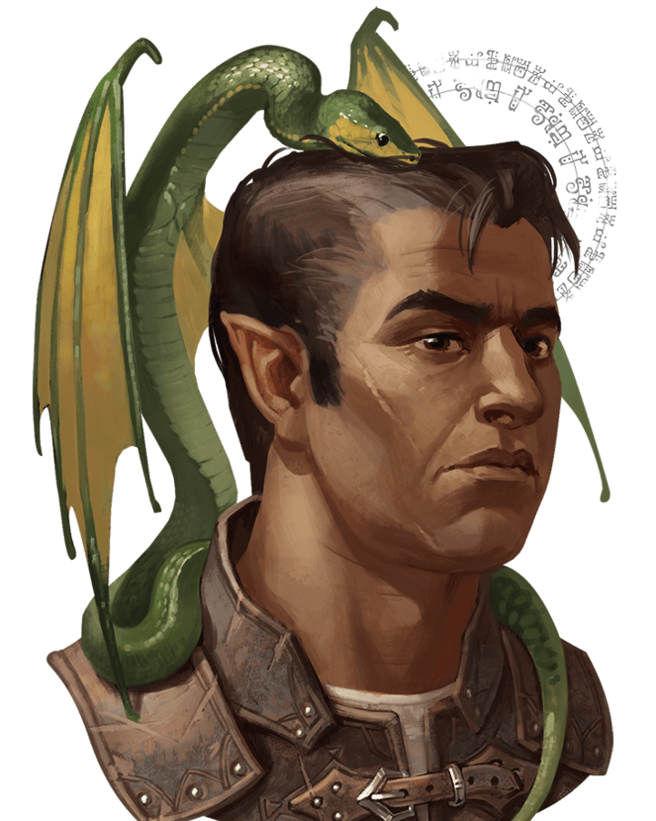
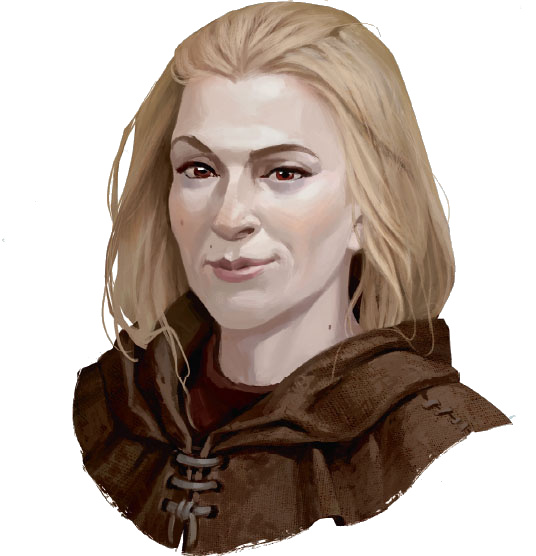

# **STORM KING'S THUNDER**

----
# Nitakula Wisdomtoother
**Feature: Wanderer**  
  You have an excellent memory for maps and geography, and you can always recall the general layout of terrain, settlements and other features around you. In addition, you can find food and fresh water for yourself and up to five other people each day, provided that the land offers berries, small game, water and so forth.

**Personality Traits**  
  I am obsessed with keeping my face crystals shiny. An individual worthy of my attention must have beautiful face crystals. There are two kinds of people that I absolutely despise: people with bad breath, and people that talks about books. I also sometimes have trouble recognizing sarcasm, and take what people say for its face value; often led to unnecessary fights according to my past travel companions. Haste to draw blade, never miss a smash. BASH HEAD TAKE CRYSTALS.

**Ideals**  
  A foe with a face pearls still attached to their jaw is an enemy yet to be defeated. I believe in my own judgement, though decisions must not be made with rush. Once decided, it must be carried out no matter the cost.

**Bonds**  
  All I wish is to spread the wonderful good words about dental hygiene to the world

**Flaws**  
  Anybody calling me weak or looks down at me based on my physical appearance. Very very afraid of heights. Sometimes dumb as a rock.

# World Map

----

# PLACES  

## Nightstone
- **Morak Urgray**   

  - Pesudo-leader of Nightstone. Runs the local inn
  - Gave us a letter of recommendation to show the lords of Waterdeep

## Goblin Cave near Nightstone
- **Grindlegar**  
  - Stone Giant  
  - Sethrose Cloud Giant  
  - Knew that we are coming  
  - Ordning = Divine power holding Giants in their social hierarchy.  
  - Something has broken the Ordning.   

## Shimmerhall
- **Breldin Brawnanvil**  
  Drwaf leader of Shimmerhall
- **Rella Brawnanvil**  
  Daughter of Breldin, tried up cause an uprising to overthrow her father

## Waterdeep

- **Quintin Nandor**  
  - Met in Trades Ward (Company HQ in Trades Ward)  
  - Son of Waterdeep's lord and future leader of Waterdeep

- **Helias Nandor**  
  - Quintin's brother at Waterdeep

- **Lucent enterprises**  
  - Company of the new lord of nightstone

- **Maxyer Graham**  
  - Solicited lawyer
  - 2 gp per day

- **Fish Kebob guy**  
  - Rumor: shortage of grains. Road between Waterdeep and Tribor

- **Erva**  
  - Tiefling at Boar's Gate Tavern
  - Asked Mert to give quest details to Erva. 

- **Merk**  
  - Well off looking older drwaven met at Boar's Gate Tavern  
  - One of the lord of Waterdeep, lives in Castle Ward, Pike avenue.  
  - Has trouble with security and 

### Point of Interest
- Taverns  
  - Boar's Gate Tavern (Trades Ward)  
  - Waking Gnome (Castle Ward)

## Farmhouse west of Long Road on the way to Triboar  
- Lagduf and Deardul
  - Happy little halfing family

## Westbridge
- Hobgoblins had taken over the town two weeks prior to our arrival.
- Captured by hobgoblins
- Killed all Hobgoblins
  - Baut (Warrior)
  - Revnak (Ranger)

- Found a note asking for the Fire Giant Lord (Duke Zalto) to send reinforcements

## Triboar
- Darathra Lord Protector of Triboar
  - Unsure of what's going on with the Giants or why Hobgoblins are attacking.
  - Member of the Harpers

- Drunken Troll
  - Priest tavern keeper. Mirak frequented here.

- North Shield House (Tavern)
  - Vergala - unsure of the situations neither

- From the dead Fire Giants
  - Found out that the fire giants were using some form of rod that led them to the adamantine slab

## Yartar
- Lord Arton Roserio
  - Found him wrapped out in some form of goo.
  - Likely drifted down from the river that passes from Yartar.
  - Was out at night, remembers something about a golden goose.
  - Remember a woman with black hair and purple dress.
  - Golden Goose could refer to Grand Dame River Boat

### Notes 
- Mask Lords runs Waterdeep

----

# Allies
- **Felgolos**
  - Dragon disguised as a halfling
  - Exploring the world
  - Dislikes Zhentarim org
- **Zephyrus**
  - Cloud Giant
  - Lives on the cloud tower
  - Was attacked by a blue dragon in his tower after trying to contact another plane

---- 

# Enemies

## Zhentarim 
- Underground organization up to no good

  - **Xolkin**  
    
    - Leader of the the spy group
    - Felgolos kidnapped him

  - **Kella**
    
    - Escaped from us at the Goblin cave  

----

# Quests

- Road blockage between Waterdeep Tribor (Helios Nandor) __DONE__
  - Find and return Farren Nandor (500gp) 
  - Clear the blockade (500gp)

- From Mert (Waterdeep) __DONE__
  - 250gp to retrieve an unicorn statue (stolen, seems sincere about being stolen)    
  - It's at blue alley in sea ward  

- Find Frost Giant Parshnag __DONE__
 - Friendly roaming giant. Likes small folks
 - Can be found in the North

- Jacoldy & Thelsom __DONE__
 - Mirak, their brother is missing. Thinks his wife killed her.
   - Last seen in the town square
 - Tolmora, the wife, north of the town
 - Reward: small stack of magicla javelins

- Darathra Shendrel
  - Darathra is a member of the Harpers and requests you bring information to make her organization aware of the situation.  Bring a platinum badge bearing the Triboar insignia to Dral Thelev, the one-eyed, half-orc proprietor of Danivarr's House in Everlund.  Tell Dral of the giant attacks you have witnessed.  The Harpers will be able to help.
  You receive a platinum badge with three boars on it.

- Darz Helgar
  - As a sign of thanks, Darz Helgar lets the Dags know there is a wanted outlaw named the Weevil, a dwarf wanted in Mirabar.  The reward is 5,000 gp delivered alive to the authorities in Mirabar.  Darz saw the Weevil cleaning stables in Xantharl's Keep on the Long Road, but didn't see the wanted poster until a few days later.
  You receive a weathered rolled up wanted poster with a picture of the perp.

- Urgala Meltimer
  - One of Urgala's former adventuring companions, Harthos Zymorven, has a giant slayer greataxe. The last time Urgala spoke with him, Harthos was living in Zymorven Hall, his ancestral keep on the Rauvin Road northwest of Silverymoon.  Urgala thinks Harthos might part with the weapon if the characters mention her name to him and explain their reasoning for needing it.

- Lady Dezhia Rossolio 
  - Lost a family hairloom necklace at the casino. 500g for retrieving it, and another 500g for finding out what happened to Arton.

- Dissapearance of lords in Yartar
  - Talk to Waterbaron Nestra Ruthiol about nobles disappearing
  - Missing lords:
    - Arton Rosalio (dissapeared 3 days ago)
    - All frequents the River Dame casino
    - Timothy: missing for 4-5 weeks ago, Jacob missing for 2 weeks

----

# House Keeping Notes

- Dragonscale Leather Armor to pick up at Yartar

----

# Lore

Amod the Old Father 
- God of the all giants
- Create the structure of all giants to live by
- Everything 

King Hekathon
- King of giant society
- Queen is dead for unknown reasons

Giant Lords
- Hill Giant - Chief Guh
- Stone Giant - Thane Kayalithica
- Frost Giant - Jarl Storvald
- Fire Giant - Duke Zalto
- Cloud Giant - Countess Sansuri
- Storm Giant - King Hekaton
  - Queen is dead for unknown reasons

Ordoning
- System that kept the giants in place, keep the society in order

Spine of the World (mountainous range)
- Live an oracle that knows and can help
